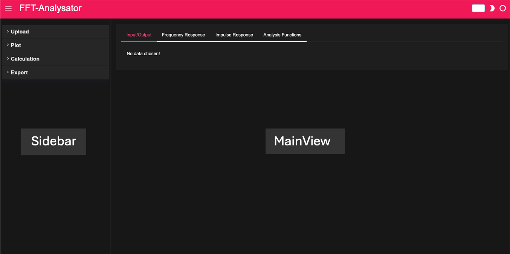
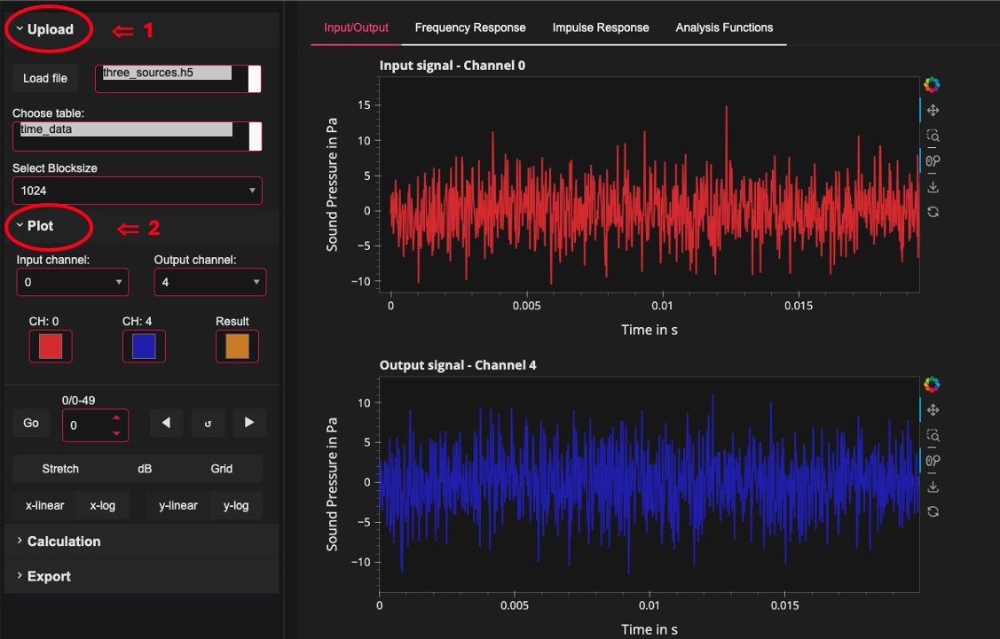
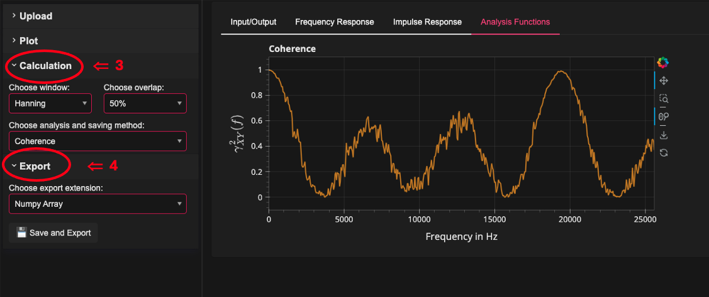
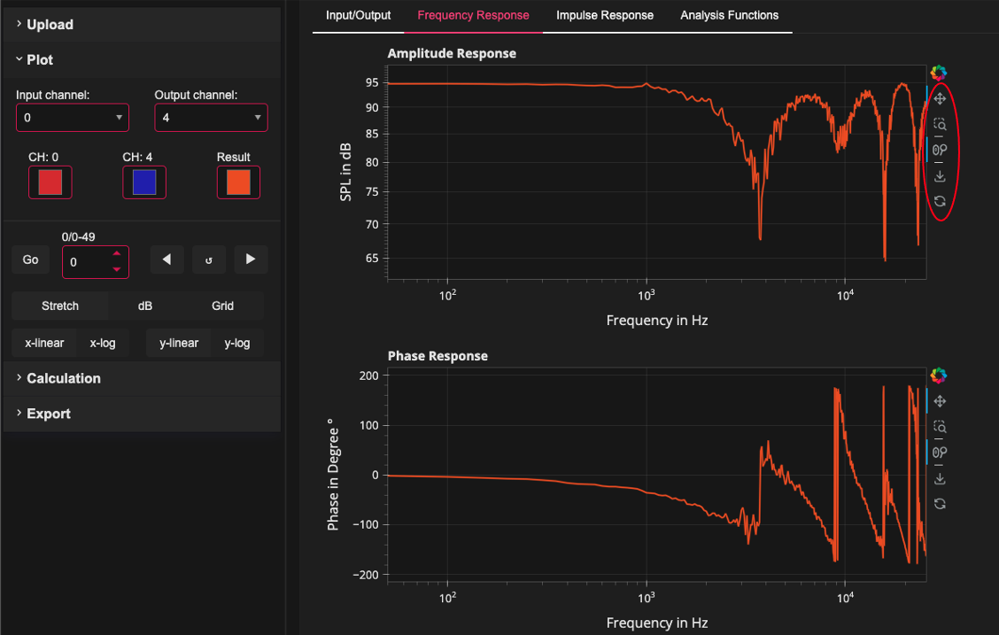

# User Guide and Screenshots

### A short guide to running and operating the app.

The graphic user interface (GUI) of the app is divided into two components (Fig. 1)
The Sidebar is used for uploading and exporting the .h5 files, as well as for interacting with
the plots and to calculate the analysis functions.

The MainView is used to visualize the signals in a diagram. The representation of the diagrams for
Input/Output - time signals, frequency response, impulse response and analysis functions carried out in individual subtabs.

  

    <figure>
        
        <figcaption>Fig.1 Overview GUI devided into Sidebar and MainView</figcaption>
    </figure>

 
## Sidebar

The sidebar consists of 4 menu items:

- Upload
- Plot
- Calculation 
- Export

  

### 1. Upload

In the upload section, the .h5 files can be read in.
To do this, the “Load file” button must be pressed. A window opens in which the file on the hard drive can be selected and the path to the App is passed on. If the .h5 file consists of several tables, a single table can be selected.
For further processing of the individual signals, it is possible to select a blocksize suitable for a specific application under the drop-down menu: "Select Blocksize".

### 2. Plot

The section plot is used, among other things, to select the channel for the input or output signal, which can be selected in the corresponding dropdowns. Furthermore, it is also possible to select the Channel Color and Result Color here. Since the time signals of a channel are divided into blocks, you can either use the arrow key buttons to switch through the individual blocks or select an individual block by setting the index of a block and then pressing the "Go" button.

To get a broader view of the plots, you can stretch them using the “Stretch” button. Activating a grid is also possible by pressing the “Grid” button. Since the values ​​of some analysis functions, such as the frequency response, are often displayed in dB, they can be converted into decibels using the "dB" button.

A logarithmic representation of the axes of the diagrams is also possible.
All you have to do is choose between the "x/y-linear" and x/y_log" buttons.

Fig. 2 represents the Upload and Plot sections and also illustrates the setting options, that was described above.

    

        <figure>
            
            <figcaption>Fig.2 Sidebar Sections Upload & Plot</figcaption>
        </figure>
    

### 3. Calculation

The calculations of the analysis functions take place under the Calculation section. In the "Choose analyze and saving method" dropdown, the analysis function that is visualized in the MainView under the Analysis Function tab is selected and can then be saved in the Export section. 
Considering Fig. 3, the analysis function “Coherence” is currently visualized in the MainView. When visualizing in the tab mentioned, Impulse Response, Amplitude Response, Phase Response are excluded as these are visualized in a separate tab.

Another setting option offers the selection of the window function and the overlap, which can each be selected in a dropdown. They are used to calculate the spectra, which is done block by block and then averaged over the frequencies.

### 4. Export

Die Export Section dient ausschließlich zur Speicherung der Daten.
Wie schon bereits in der Sektion Calculation beschrieben, kann die ausgewählte Analysefunktion abgepeichert werden.
je nach Auswahl im dropdown "Choose export extension", ist es möglich die Daten als Numpy Array oder binäres File abzuspeichern.
Für die Finale Speicherung des Files auf der Festplatte muss der Button: Save and Export gedrückt werden.

The export section is used exclusively to store the data.
As already described in the Calculation section, the selected analysis function can be saved.
Depending on the selection in the "Choose export extension" dropdown, it is possible to save the data as a Numpy array or binary file.
To finally save the file on the hard drive, the button: Save and Export must be pressed and the storage location must be selected

    

        <figure>
            
            <figcaption>Fig.3 Sidebar Sections Calculation & Export</figcaption>
        </figure>
    

## MainView

The Main View consists of 4 Tabs:

- Input/Output
- Frequency Response
- Impulse Response 
- Analysis Functions

In the Input/Output tab, the time signals from the individual channels of a .h5 file, which represent the input or output signal, are visualized. In contrast to the other analysis functions such as coherence, correlation, power spectrum or cross-correlation spectrum, in this app the frequency response and impulse response should be displayed in a separate tab and should be calculated when the data is read in or the channels are selected.

To save the plot as a .png file, you can press the icon with the down arrow, which is located to the right of the plot (Fig. 4 marked in red). It is also possible to zoom or move the plot.

    

        <figure>
            
            <figcaption>Fig.4 MainView to visualize plots</figcaption>
        </figure>
    

  

By following this guide, you should be able to navigate and use the app efficiently. If you have any questions or need further assistance, please refer to the documentation.